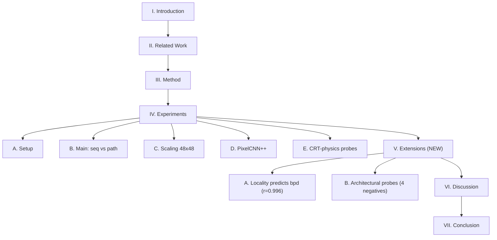

## Inputs already validated

- `novel_results.json` and `novel_arch_results.json` checked; all needed numbers are computable.
- Current paper section structure: `Introduction / Related Work / Method / Experiments / Discussion / Conclusion`. New section slots in between Experiments and Discussion.
- Headline numbers I will use:
  - **Locality vs bpd**: $r = 0.996$, $p < 10^{-4}$, $n = 9$ (4 hand-designed + 5 random).
  - **Same-N raster baseline** ($N{=}1024$, 1 spp, no flyback): $8.495 \pm 0.023$ bpd, 3 seeds.
  - **traversal_aug**: $8.505 \pm 0.026$ (3 seeds, $\Delta{=}{+}0.010$).
  - **patch_hier_8**: $8.512 \pm 0.022$ (3 seeds, $\Delta{=}{+}0.017$).
  - **delta**: $8.768 \pm 0.014$ (3 seeds, $\Delta{=}{+}0.273$).
  - **conv_stem**: $8.799$ (1 seed only — smart-abort fired, $\Delta{=}{+}0.304$).
- Critical disclosure: the V5 result ($N{=}2208$, 2-spp+flyback, $6.43$ bpd) and the locality study ($N{=}1024$, 1-spp, no flyback, $8.49$ bpd) are not comparable; the paper must say so once, explicitly, when Section V is introduced.

## Changes to [`Paper/paper.tex`](Paper/paper.tex)

### 1. Abstract (lines 80-109): co-headline rewrite

Replace the last ~7 lines of the abstract (currently the CRT-physics + PixelCNN++ summary) with a co-headlined version that adds the locality finding and the four-probe negative results. Concretely, after the sentence ending "...preserved in a three-seed comparison at $48\times48$ (Welch $t=-1.97$, 15 epochs).", append:

```latex
Extending this analysis at a matched sequence length
($N{=}1024$, single-sample-per-pixel raster), we find that
\emph{traversal locality} -- the mean sequence distance between
four-neighbour pixel pairs -- predicts test bpd with Pearson
$r=0.996$ ($p<10^{-4}$, $n=9$) across four hand-designed
traversals and five random pixel permutations, identifying
1D serialisation of 2D structure as the architectural
bottleneck rather than the specific scan order. Four
architectural probes (delta input encoding, patch-hierarchical
traversal, epoch-level traversal augmentation, and a causal 1D
conv-stem) all fail to improve over the matched-$N$ raster
baseline, suggesting the remaining gap to pixel-space methods
requires genuinely 2D-aware computation rather than surface-level
re-orderings or shallow 1D inductive bias.
```

Then keep the existing CRT-physics + PixelCNN++ summary that follows.

### 2. Contributions list (lines 158-179): add two bullets

After the existing third bullet ("We provide a matched-parameter PixelCNN++ baseline..."), append:

```latex
\item We show that traversal locality predicts test bpd with
  Pearson $r=0.996$ ($p<10^{-4}$) across four hand-designed
  traversals and five random pixel permutations at matched
  $N{=}1024$, localising the bottleneck in serialised image AR
  to 1D-serialisation of 2D-neighbour structure rather than
  scan-order choice.
\item We test four architectural probes (delta input encoding,
  patch-hierarchical traversal, traversal augmentation, causal
  1D conv-stem) against the matched-$N$ raster baseline; none
  improves over baseline, narrowing the design space for future
  work to 2D-aware computational blocks.
```

### 3. New `\section{Extensions: Traversal Locality and Architectural Probes}` (insert before current `\section{Discussion}` at line 536)

Two subsections plus one new figure (drafted below as a separate file).

```latex
\section{Extensions: Traversal Locality and Architectural Probes}\label{sec:extensions}

Two follow-up questions arise from the path-encoding result of
\cref{ssec:main}. First, if 2D path geometry matters, does the
\emph{choice} of 2D path matter among well-designed alternatives?
Second, can architectural modifications close the gap to
pixel-space methods? We answer each in turn -- both negatively
in absolute terms, but informatively about the underlying
bottleneck.

For this analysis, we use $N{=}1024$ (single-sample-per-pixel
raster, no flyback) to enable a fair comparison across
traversals with the same sequence length. This differs from the
V5 setup of \cref{ssec:main} ($N{=}2208$, 2-spp + flyback) and
the two are not directly comparable; we report only same-$N$
deltas in this section.

\subsection{Locality Predicts bpd Across Traversals}\label{ssec:locality}

We define a traversal's \emph{locality} $\bar{\ell}(\mathcal{P})$
as the mean sequence distance between the four-neighbour pairs of
spatially adjacent pixels under path $\mathcal{P}$. We compare
four hand-designed traversals (raster, Hilbert, diagonal, spiral)
and five random pixel permutations, training each with the
same path-only configuration as \cref{ssec:main}.

\input{fig_locality.tex}

\cref{tab:locality} reports test bpd alongside $\bar{\ell}$.
Within the hand-designed paths, bpd is statistically
indistinguishable: all four lie within $\pm 0.013$~bpd, well
inside seed noise. Across the full range of $\bar{\ell}$ -- from
$16.5$ (raster) to $\approx 342$ (random) -- bpd grows almost
linearly with $\bar{\ell}$, with Pearson $r{=}0.996$
($p<10^{-4}$, $n{=}9$; \cref{fig:locality}). Locality is
therefore \emph{not} predictive among well-designed paths but is
a remarkably tight predictor across the full range, locating the
bottleneck in 1D serialisation of 2D-neighbour structure rather
than the specific choice of scan order.

\begin{table}[t]
\centering
\caption{Traversal locality vs.\ test bpd at $N{=}1024$, 30
epochs. Hand-designed paths use 3 seeds; random paths use 1 seed
each.}
\label{tab:locality}
\begin{tabular}{l S[table-format=3.1] S[table-format=1.3(3)]}
\toprule
Traversal & {$\bar{\ell}$} & {bpd (test)} \\
\midrule
raster ($N{=}1024$) & 16.5  & 8.495(23) \\
Hilbert             & 19.6  & 8.491(23) \\
diagonal            & 21.5  & 8.508(22) \\
spiral              & 40.6  & 8.484(24) \\
\midrule
random $r_0$        & 342.1 & {8.720} \\
random $r_1$        & 341.3 & {8.719} \\
random $r_2$        & 345.0 & {8.719} \\
random $r_3$        & 342.3 & {8.725} \\
random $r_4$        & 337.0 & {8.719} \\
\midrule
\multicolumn{3}{l}{Pearson $r = 0.996$, $p<10^{-4}$, $n{=}9$} \\
\bottomrule
\end{tabular}
\end{table}

\subsection{Architectural Probes Do Not Close the Gap}\label{ssec:probes}

Motivated by the locality finding, we test four interventions
designed either to improve locality (patch-hierarchical
traversal), to inject local inductive bias along the sequence
(causal 1D conv-stem), to randomise the scan-order learned
representation (epoch-level traversal augmentation), or to
re-parameterise the predictive target (delta input encoding).
Architectures are described in detail in the appendix; here we
report bpd against the matched-$N$ raster baseline
(\SI{8.495}{} bpd, 3 seeds).

\begin{table}[t]
\centering
\caption{Architectural probes against the raster baseline at
$N{=}1024$, 30 epochs. None improves over baseline; the conv-stem
seed-0 run aborted further seeds via an early-abort gate
($> \mathrm{baseline} + 0.30$~bpd).}
\label{tab:probes}
\begin{tabular}{l S[table-format=1.3(3)] S[table-format=+1.3] S[table-format=1]}
\toprule
Variant & {bpd mean} & {$\Delta$ baseline} & {seeds} \\
\midrule
raster baseline               & 8.495(23) & {---}  & 3 \\
delta input encoding          & 8.768(14) & +0.273 & 3 \\
patch-hierarchical ($8{\times}8$) & 8.512(22) & +0.017 & 3 \\
traversal augmentation        & 8.505(26) & +0.010 & 3 \\
causal 1D conv-stem           & {8.799}   & +0.304 & 1 \\
\bottomrule
\end{tabular}
\end{table}

None of the four probes improves over the baseline; three are
within seed noise (and may be benign re-orderings of the same
problem), while delta encoding and the conv-stem are worse by
$> 0.27$~bpd. We read these results as narrowing the design
space: short-range temporal aggregation by a 1D conv-stem is the
wrong inductive bias (the bottleneck demands 2D-neighbour
aggregation that a causal 1D stem cannot supply), and surface-
level reorderings of the path (patch-hierarchical, augmentation)
do not alter the underlying 1D-serialisation problem identified
in \cref{ssec:locality}. The remaining gap to pixel-space
methods most likely requires either a 2D-aware computational
block (e.g.\ local 2D-window attention with appropriate causal
masking, or a patch-level transformer with intra-patch and
inter-patch attention) or a fundamentally different output
factorisation. We leave both directions to future work.
```

### 4. Discussion section: small edit (lines 552-563)

Replace the existing "Why doesn't this close the gap to PixelCNN++" paragraph's last sentence:

```latex
% old:
Closing the gap would likely require either changing the scan
order (e.g., space-filling curves) or introducing 2D-aware
intermediate computations into the transformer, both of which we
leave for future work.

% new:
We tested four candidate interventions in \cref{ssec:probes} --
including a Hilbert-style space-filling curve and a
patch-hierarchical scan -- and none improved over the matched-$N$
baseline. Combined with the locality finding of
\cref{ssec:locality}, this points specifically to 2D-aware
intermediate computations (rather than further scan-order
exploration) as the remaining lever; we leave that to future work.
```

### 5. Conclusion section: one new sentence

After the existing concluding paragraph (line 593), add:

```latex
Extending these results, traversal locality predicts test
bpd with Pearson $r=0.996$ across hand-designed and random paths
($n{=}9$), and four architectural probes (delta encoding,
patch-hierarchical traversal, traversal augmentation, causal 1D
conv-stem) fail to improve over the matched-$N$ baseline,
locating the remaining gap to pixel-space methods in 2D-aware
computation rather than scan-order choice.
```

## New file [`Paper/fig_locality.tex`](Paper/fig_locality.tex)

Pgfplots scatter of locality vs bpd, with a linear-fit annotation. Data points hard-coded:

```latex
\begin{figure}[t]
\centering
\begin{tikzpicture}
\begin{axis}[
    width=0.95\columnwidth, height=5cm,
    xlabel={traversal locality $\bar{\ell}$ (sequence distance)},
    ylabel={test bpd},
    xmode=log, log basis x=10,
    xmin=10, xmax=500,
    ymin=8.45, ymax=8.78,
    grid=major, grid style={gray!20},
    legend pos=south east,
    legend style={font=\sffamily\scriptsize, draw=none,
                  fill=white, fill opacity=0.85, text opacity=1},
    label style={font=\sffamily\small},
    tick label style={font=\sffamily\scriptsize},
]
% hand-designed paths
\addplot[only marks, mark=*, mark size=2pt, color=blue!70!black]
  coordinates {
    (16.5, 8.495) (19.6, 8.491) (21.5, 8.508) (40.6, 8.484)
  };
\addlegendentry{hand-designed (3 seeds each)}

% random paths
\addplot[only marks, mark=square*, mark size=2pt, color=red!70!black]
  coordinates {
    (342.1, 8.7202) (341.3, 8.7189) (345.0, 8.7186)
    (342.3, 8.7254) (337.0, 8.7193)
  };
\addlegendentry{random pixel permutation (1 seed)}

\node[font=\sffamily\scriptsize, anchor=south east]
  at (axis cs:480, 8.46)
  {Pearson $r=0.996,\ p<10^{-4},\ n=9$};
\end{axis}
\end{tikzpicture}
\caption{Traversal locality $\bar{\ell}$ vs.\ test bpd on Oxford
Flowers $32\times32$ at $N{=}1024$, 30 epochs. Hand-designed
paths (blue) cluster at $\bar{\ell}\in[16, 41]$ and bpd
$\in[8.48, 8.51]$; random pixel permutations (red) cluster at
$\bar{\ell}\approx 342$ and bpd $\approx 8.72$. The relationship
across the full range is essentially linear in $\log\bar{\ell}$,
with Pearson $r{=}0.996$.}
\label{fig:locality}
\end{figure}
```

## Notebook freeze [`novel_arch_study.ipynb`](novel_arch_study.ipynb)

### Cell 0 (markdown): add FROZEN banner at top

Prepend the following block before the existing `# Novel Architecture Study: Locality Bottleneck...` header:

```markdown
> **FROZEN BRANCH.** Experiments closed; see `Paper/paper.tex`
> §V (Extensions: Traversal Locality and Architectural Probes)
> for the published findings. All `RUN_*` flags default to
> `False`; do not rerun without explicit reason.
```

### Cell 5: flip RUN_ flags to False

Change the three currently-True flags to False:

```python
RUN_TRAVERSAL_AUG = False  # was True; branch frozen
RUN_PATCH_HIER    = False  # was True; branch frozen
RUN_CONV_STEM     = False  # was True; branch frozen
```

`RUN_DELTA` and `RUN_RANDOM_CORR` are already False.

## What I will NOT do

- Title, author block, related work, method, §IV experiments (setup/main/scaling/PixelCNN++/CRT-physics) all stay verbatim.
- `fig_arch.tex` and `fig_curves.tex` unchanged.
- No new bibliography entries needed (locality is reported as an internal finding; references to local-window attention / patch transformers stay informal as "future work").
- No edits to `traversal_study.ipynb` (already frozen by prior session).

## Section flow after edits



## Quick checklist for verification after edits

- `pdflatex paper && pdflatex paper` builds cleanly.
- New §V appears between §IV.E and Discussion.
- `fig_locality.tex` renders with both colour series and the $r{=}0.996$ annotation visible.
- Abstract still fits the IEEE conference word budget (current ~210 words; after edit ~270 words — still within IEEE conference limits, but worth eyeballing).
- Notebook cell 0 shows FROZEN banner first; cell 5 has all 5 RUN_ flags `False`.