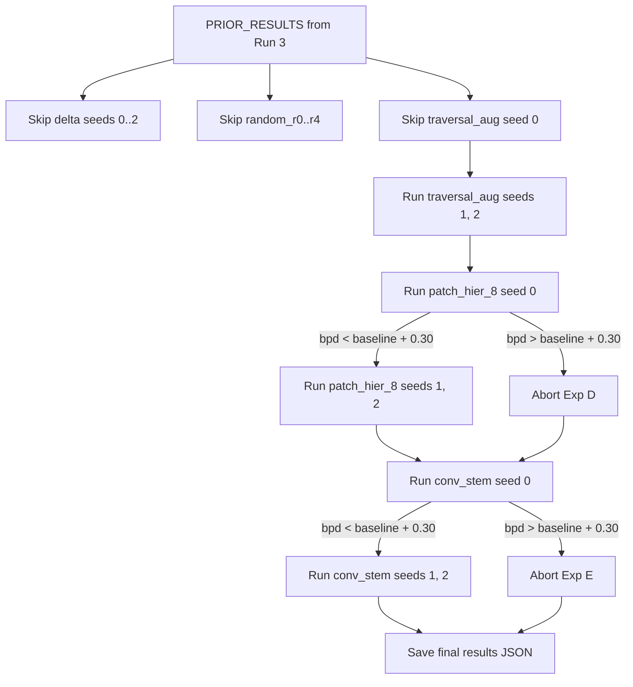

## What Run 3 actually produced

The 12 h Kaggle timeout hit during Exp C seed 1 (epoch 15 of 30), but **Exp A and Exp B finished in full**. From [`novel_arch_study.ipynb Output 1.txt`](novel_arch_study.ipynb%20Output%201.txt):

- Exp A (delta, 3 seeds): **8.7684 ± 0.0137 bpd** vs baseline 8.4950 (negative, decisive).
- Exp B (4 fixed + 5 random, 1 seed each): Pearson **r = 0.996, p < 0.0001** between `locality_mean` and bpd. Hand-designed cluster at 8.48-8.51; random at 8.72.
- Exp C (traversal_aug): seed 0 = **8.5284 bpd** (complete); seed 1 partial @ epoch 15 (no optimizer/scaler ckpt saved -> seed 1 must be rerun from scratch); seed 2 never started.

The r=0.996 result is the headline. Do not rerun delta. Do not rerun the 5 random paths.

## Refined direction

Story shifts from "which traversal wins" to: **"1D serialization of 2D image structure is locality-limited; locality predicts bpd across the full range (r=0.996); the fix is architectural, not a prettier scan order."**

Two new experiments, chosen to attack the 2D-bias bottleneck without breaking AR causality:

- **Exp D - Patch-Hierarchical Traversal (`RUN_PATCH_HIER`):** raster-over-patches × raster-within-patch at `patch_size in {4, 8}`. Pure permutation, no model change, drop-in via `path_np`. Tests whether sequence-level chunking of spatially-coherent groups helps even when global locality_mean is similar.
- **Exp E - Causal 1D Conv-Stem (`RUN_CONV_STEM`):** small `nn.Conv1d` stack inserted between `input_proj` and the transformer, **left-padded** so position t sees only positions ≤ t. Strictly preserves causality. Gives the model a learned short-range temporal aggregator (analog to a CNN front-end) without the 2D-causality nightmare. A pure 2D conv stem cannot be added without PixelCNN-style masking and is deferred.

A pure local-window-attention experiment is dropped from this scope (next session if Exp D/E are promising).

## Pre-loaded PRIOR_RESULTS (from Run 3 log, no retraining)

```python
PRIOR_RESULTS = {
    "delta":         [8.7840, 8.7584, 8.7628],
    "traversal_aug": [8.5284],                      # only seed 0; seeds 1 & 2 must run
    "random_r0":     [8.7202],
    "random_r1":     [8.7189],
    "random_r2":     [8.7186],
    "random_r3":     [8.7254],
    "random_r4":     [8.7193],
}
```

## Runtime budget (T4, ~1.27 h per seed × 30 ep)

- Finish Exp C: seed 1 + seed 2 = **~2.5 h**
- Exp D patch-hier (2 variants × 3 seeds): **~7.5 h**  - cut to `patch_size=8` only (1 variant × 3 seeds = ~4 h) if time-pressed
- Exp E conv-stem (3 seeds): **~4 h**
- Total target: **~10 h** with `patch_size=8` only, or **~14 h** (needs a 2nd session) with both patch sizes

Recommend single session: finish Exp C + Exp D at `patch_size=8` + Exp E = **~10.5 h**, leaving safety margin under the 12 h cap. Run `patch_size=4` in a follow-up session only if Exp D at 8 is promising.

## Implementation notes (for Sonnet 4.6 agent)

### Path generator — patch-hierarchical

Add to cell 4 (next to `raster_path`, `hilbert_path`, etc):

```python
def patch_hier_path(H, W, patch_size=8):
    assert H % patch_size == 0 and W % patch_size == 0
    coords = []
    nph, npw = H // patch_size, W // patch_size
    for pr in range(nph):
        for pc in range(npw):
            r0, c0 = pr * patch_size, pc * patch_size
            for dr in range(patch_size):
                for dc in range(patch_size):
                    coords.append((c0 + dc + 0.5, r0 + dr + 0.5))
    return np.array(coords, dtype=np.float32), np.ones(len(coords), dtype=bool)
```

Register in `FIXED_TRAVERSALS` only for the correlation table:

```python
FIXED_TRAVERSALS["patch_hier_8"] = lambda H,W: patch_hier_path(H, W, patch_size=8)
```

### Conv-stem — causal 1D variant

New class in cell 10 (next to `DeltaSignalTransformer`):

```python
class CausalConv1dStem(nn.Module):
    """Two left-padded conv1d layers. Strictly causal."""
    def __init__(self, d_model, kernel_size=5):
        super().__init__()
        self.k = kernel_size
        self.c1 = nn.Conv1d(d_model, d_model, kernel_size)
        self.c2 = nn.Conv1d(d_model, d_model, kernel_size)
        self.act = nn.GELU()
    def forward(self, x):  # x: [B, N, D]
        x = x.transpose(1, 2)                                # [B, D, N]
        x = F.pad(x, (self.k - 1, 0)); x = self.act(self.c1(x))
        x = F.pad(x, (self.k - 1, 0)); x = self.act(self.c2(x))
        return x.transpose(1, 2)                             # [B, N, D]

class ConvStemSignalTransformer(SignalTransformer):
    def __init__(self, cfg, path_np, beam_on_np):
        super().__init__(cfg, path_np, beam_on_np)
        self.stem = CausalConv1dStem(cfg.d_model, kernel_size=5)
    def _encode(self, signal_in, clip_emb):
        B, N, _ = signal_in.shape
        x = self.input_proj(signal_in); cond = self.cond_proj(clip_emb)
        x = self.stem(x)                                     # NEW
        if self.seq_pe:  x = self.seq_pe(x)
        if self.path_pe: x = self.path_pe(x, self.path_np)
        mask = self._causal_mask(N, signal_in.device)
        for blk in self.blocks: x = blk(x, cond, mask)
        return self.ln_out(x)
```

Param overhead: `2 × (256×256×5) ≈ 0.66 M`. Total ≈ 6.33 M vs 5.67 M baseline — note this in the result table, **do not param-match** (param-matching adds confounders to a single experiment; flag the gap honestly in the paper instead).

### Durable JSON checkpoint (resume-safe)

New helper, called from every experiment after each seed completes:

```python
RESULTS_PATH = f"{WORK_DIR}/novel_results.json"

def load_results():
    if not os.path.exists(RESULTS_PATH): return {}
    with open(RESULTS_PATH) as f: return json.load(f)

def save_result(exp_name, seed, bpd):
    data = load_results()
    data.setdefault(exp_name, {})[str(seed)] = float(bpd)
    with open(RESULTS_PATH, "w") as f: json.dump(data, f, indent=2)
```

At top of cell 5 (after PRIOR_RESULTS is defined), merge disk state:

```python
_disk = load_results()
for k, seed_map in _disk.items():
    bpds = [seed_map[s] for s in sorted(seed_map.keys(), key=int)]
    PRIOR_RESULTS.setdefault(k, bpds)
```

Each experiment loop changes from "run all 3 seeds" to:

```python
done = set(load_results().get(exp_name, {}).keys())
for seed in (0, 1, 2):
    if str(seed) in done: continue
    # ... train ...
    save_result(exp_name, seed, m["bpd_pixel"])
```

### Smart-abort safety net

In each new experiment block, after seed 0:

```python
ABORT_THRESHOLD = 0.30        # bpd above baseline
FORCE_ALL_SEEDS = False

if not FORCE_ALL_SEEDS and seed == 0 and m["bpd_pixel"] > BASELINE_BPD_MEAN + ABORT_THRESHOLD:
    print(f"  ABORTED: {exp_name} seed 0 = {m['bpd_pixel']:.4f} > "
          f"baseline + {ABORT_THRESHOLD} -> skipping seeds 1,2.")
    break
```

### Framing rewrite

Cell 0 markdown gets replaced with the new thesis. Key paragraphs:

- Headline: r = 0.996 (locality vs bpd) across 9 traversals (4 hand-designed + 5 random).
- Delta encoding tested and rejected at 8.77 bpd.
- New axis under test: 2D inductive bias (patch-hierarchical, causal conv-stem).
- The paper does **not** claim SOTA; it identifies and quantifies the 2D-bias bottleneck in serialized image AR.

### Final table

Consolidated table at the end must include columns: `name`, `bpd mean`, `bpd std`, `locality_mean`, `params (M)`, `Δ vs baseline`. Sort by `bpd mean`. Mark new experiments with a `*`.

## Mermaid - experiment dependency / resume flow



## Files to edit

- [`novel_arch_study.ipynb`](novel_arch_study.ipynb) — only this notebook. Do not touch `traversal_study.ipynb` (already frozen).

---

## Agent prompt for Claude Sonnet 4.6

Paste the block below verbatim into the Sonnet 4.6 agent. It is self-contained except for the file path.

```text
You are editing /home/assem-elqersh/Desktop/CRT/novel_arch_study.ipynb.
Do not modify any other file. Do not run the notebook.

CONTEXT - already executed on Kaggle T4 in a 12-hour session:
- Exp A (delta) finished, 3 seeds: bpds [8.7840, 8.7584, 8.7628]. Negative result.
- Exp B (random correlation) finished, 5 random paths.
  Locality mean -> bpd:
    raster_1spp 16.5 -> 8.4950
    hilbert     19.6 -> 8.4915
    diagonal    21.5 -> 8.5076
    spiral      40.6 -> 8.4837
    random_r4  337.0 -> 8.7193
    random_r1  341.3 -> 8.7189
    random_r0  342.1 -> 8.7202
    random_r3  342.3 -> 8.7254
    random_r2  345.0 -> 8.7186
  Pearson r = 0.996, p < 0.0001.
- Exp C (traversal_aug) seed 0 only: 8.5284 bpd. Seeds 1 and 2 never finished.
- Baseline raster_1spp: 8.4950 +/- 0.0233 bpd (3 seeds), from a prior notebook.

NEW PAPER THESIS to encode in cell 0 markdown:
"Serialized autoregressive image modeling is locality-limited. Across a 20x range
 of traversal locality (16.5 to 345), bpd grows linearly with locality_mean
 (Pearson r = 0.996, p < 0.0001, n = 9). Hand-designed paths are interchangeable
 within ~0.03 bpd; the bottleneck is 1D serialization of 2D structure. We test
 two architectural interventions: patch-hierarchical traversal and a causal 1D
 conv stem. Delta encoding was tested and rejected (8.77 vs 8.50 bpd)."

REQUIRED EDITS (apply in order, edit one cell at a time using the notebook tool):

1. Cell 0 markdown: replace the entire summary with the new thesis above plus
   a short table of the r=0.996 result. Remove the "three experiments" table -
   it is now outdated.

2. Cell 4 (traversal generators): add the function `patch_hier_path(H, W, patch_size)`:

    def patch_hier_path(H, W, patch_size=8):
        assert H % patch_size == 0 and W % patch_size == 0
        coords = []
        nph, npw = H // patch_size, W // patch_size
        for pr in range(nph):
            for pc in range(npw):
                r0, c0 = pr * patch_size, pc * patch_size
                for dr in range(patch_size):
                    for dc in range(patch_size):
                        coords.append((c0 + dc + 0.5, r0 + dr + 0.5))
        return np.array(coords, dtype=np.float32), np.ones(len(coords), dtype=bool)

   And add `FIXED_TRAVERSALS["patch_hier_8"] = lambda H,W: patch_hier_path(H, W, 8)`.

3. Cell 5 (flags + PRIOR_RESULTS): change the flag block to:

    RUN_DELTA         = False
    RUN_RANDOM_CORR   = False
    RUN_TRAVERSAL_AUG = True
    RUN_PATCH_HIER    = True
    RUN_CONV_STEM     = True
    FORCE_ALL_SEEDS   = False
    ABORT_THRESHOLD   = 0.30

    PRIOR_RESULTS: dict = {
        "delta":         [8.7840, 8.7584, 8.7628],
        "traversal_aug": [8.5284],
        "random_r0":     [8.7202],
        "random_r1":     [8.7189],
        "random_r2":     [8.7186],
        "random_r3":     [8.7254],
        "random_r4":     [8.7193],
    }

   Also keep BASELINE_NAME, BASELINE_BPD_MEAN=8.4950, BASELINE_BPD_STD=0.0233,
   and FIXED_TRAVERSAL_RESULTS (already correct).

4. Cell 5 (or a new cell directly after it): add JSON resume helpers:

    RESULTS_PATH = f"{WORK_DIR}/novel_results.json"

    def load_results():
        if not os.path.exists(RESULTS_PATH): return {}
        with open(RESULTS_PATH) as f: return json.load(f)

    def save_result(exp_name, seed, bpd):
        data = load_results()
        data.setdefault(exp_name, {})[str(seed)] = float(bpd)
        with open(RESULTS_PATH, "w") as f: json.dump(data, f, indent=2)

    _disk = load_results()
    for k, seed_map in _disk.items():
        bpds = [seed_map[s] for s in sorted(seed_map.keys(), key=int)]
        PRIOR_RESULTS.setdefault(k, bpds)

5. Cell 10 (model classes): add the conv-stem model AFTER DeltaSignalTransformer:

    class CausalConv1dStem(nn.Module):
        def __init__(self, d_model, kernel_size=5):
            super().__init__()
            self.k = kernel_size
            self.c1 = nn.Conv1d(d_model, d_model, kernel_size)
            self.c2 = nn.Conv1d(d_model, d_model, kernel_size)
            self.act = nn.GELU()
        def forward(self, x):
            x = x.transpose(1, 2)
            x = F.pad(x, (self.k - 1, 0)); x = self.act(self.c1(x))
            x = F.pad(x, (self.k - 1, 0)); x = self.act(self.c2(x))
            return x.transpose(1, 2)

    class ConvStemSignalTransformer(SignalTransformer):
        def __init__(self, cfg, path_np, beam_on_np):
            super().__init__(cfg, path_np, beam_on_np)
            self.stem = CausalConv1dStem(cfg.d_model, kernel_size=5)
        def _encode(self, signal_in, clip_emb):
            B, N, _ = signal_in.shape
            x = self.input_proj(signal_in); cond = self.cond_proj(clip_emb)
            x = self.stem(x)
            if self.seq_pe:  x = self.seq_pe(x)
            if self.path_pe: x = self.path_pe(x, self.path_np)
            mask = self._causal_mask(N, signal_in.device)
            for blk in self.blocks: x = blk(x, cond, mask)
            return self.ln_out(x)

6. Cell 13 (sanity check): extend it to also instantiate ConvStemSignalTransformer
   and print its param count. Assert forward returns the right shape. Do not
   assert it equals SignalTransformer param count - the stem adds ~0.66 M.

7. Cell 15 (Exp A runner): wrap the training loop so that:
   - Reads `done = set(load_results().get("delta", {}).keys())` and skips
     any seed already in `done`.
   - After each completed seed: `save_result("delta", seed, bpd)`.
   - Keep the PRIOR_RESULTS preload exactly as already written.

8. Cell 17 (Exp B): same pattern. For each random seed:
   - Check `load_results().get(f"random_r{rand_seed}", {})` before training.
   - Save after each. Already covered by PRIOR_RESULTS guard, just add the
     disk save.

9. Cell 19 (Exp C runner): same pattern for "traversal_aug". Iterate seeds
   (0, 1, 2). Skip seed 0 because PRIOR_RESULTS has it. Train seeds 1 and 2.
   Save each. Compute mean+std from PRIOR_RESULTS + new seeds combined.

10. NEW cell after cell 19: Exp D (patch-hier). Mirror Exp C structure:

    if RUN_PATCH_HIER:
        path_np, beam_on_np = patch_hier_path(32, 32, patch_size=8)
        exp_name = "patch_hier_8"
        done = set(load_results().get(exp_name, {}).keys())
        seed_results = []
        for seed in (0, 1, 2):
            if str(seed) in done:
                bpd = load_results()[exp_name][str(seed)]
                seed_results.append({"bpd_pixel": bpd})
                continue
            torch.manual_seed(seed); np.random.seed(seed); random.seed(seed)
            cfg = copy.deepcopy(BASE_CFG); cfg.seed = seed
            cfg.ckpt_dir = f"{WORK_DIR}/ckpt_phier8_s{seed}"
            model    = SignalTransformer(cfg, path_np, beam_on_np).to(DEVICE)
            train_ds = FlowerSignalDataset(hf_train, path_np, beam_on_np,
                           32, FLOWER_NAMES, _clip_model, _clip_proc, DEVICE)
            test_ds  = FlowerSignalDataset(hf_test,  path_np, beam_on_np,
                           32, FLOWER_NAMES, _clip_model, _clip_proc, DEVICE)
            print(f"\n=== {exp_name} seed={seed} ===")
            m = train(cfg, model, _clip_model, train_ds, val_ds=test_ds,
                      ckpt_dir=cfg.ckpt_dir)
            print(f"  bpd_pixel = {m['bpd_pixel']:.4f}")
            save_result(exp_name, seed, m["bpd_pixel"])
            seed_results.append(m)
            if (not FORCE_ALL_SEEDS and seed == 0
                    and m["bpd_pixel"] > BASELINE_BPD_MEAN + ABORT_THRESHOLD):
                print(f"  ABORTED: {exp_name} seed 0 too high -> skipping rest")
                break

11. NEW cell after Exp D: Exp E (conv-stem). Same structure but with:

        model = ConvStemSignalTransformer(cfg, path_np, beam_on_np).to(DEVICE)
        path_np, beam_on_np = raster_path(32, 32, spp=1, flyback_frac=0.0)
        exp_name = "conv_stem"
        cfg.ckpt_dir = f"{WORK_DIR}/ckpt_convstem_s{seed}"

12. Final consolidated-results cell (cell 20): add rows for "patch_hier_8" and
    "conv_stem" pulled from `load_results()`. Add a `params (M)` column.
    Add a `locality_mean` column where applicable. Sort ascending by bpd.

13. Run a final notebook-wide lint check using ReadLints on
    novel_arch_study.ipynb. Fix only newly introduced linter errors.

DO NOT:
- Delete or rerun the delta or random correlation cells.
- Change the DMoL head, training loop, or evaluator.
- Add a true 2D conv stem (it breaks causality with arbitrary paths).
- Change cfg.epochs from 30, cfg.batch_size from 32, or cfg.lr from 3e-4.
- Param-match the conv-stem model by shrinking the transformer. Just report
  the param count honestly.

VERIFY at the end:
- All 21 original cells + 2 new experiment cells = 23 cells (approx).
- Cell 5 contains all 5 RUN_ flags.
- Cell 13 sanity check imports ConvStemSignalTransformer and runs forward.
- Cell 20 includes all experiments in the final table.
- No call to delta or random training loops will execute on rerun because
  PRIOR_RESULTS guards them.
```

## After Sonnet edits

User runs the notebook on Kaggle with all the flags from edit step 3 set. Expected wall time ~10.5 h. After completion, paste the final consolidated table into chat and decide framing (pivot vs augment).